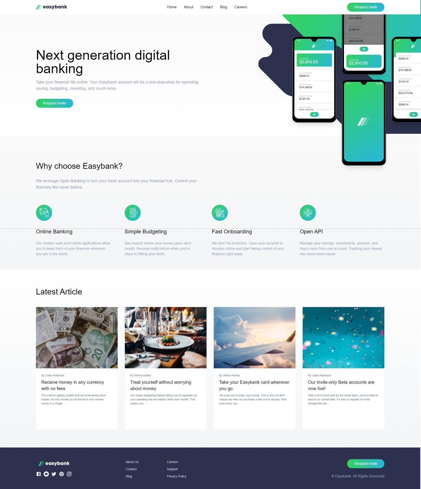

## Table of contents

- [Overview](#overview)
  - [The challenge](#the-challenge)
  - [Screenshot](#screenshot)
  - [Links](#links)
- [My process](#my-process)
  - [Built with](#built-with)
  - [What I learned](#what-i-learned)
  - [Continued development](#continued-development)
  - [Useful resources](#useful-resources)

## Overview

### The challenge

Users should be able to:

- View the optimal layout for the site depending on their device's screen size
- See hover states for all interactive elements on the page

### Screenshot

### Links

- Solution URL: [https://github.com/draristizabalr/EasyBankProof](https://github.com/draristizabalr/EasyBankProof)
- Live Site URL: [https://easybankproof.netlify.app/](https://easybankproof.netlify.app/)

## My process

### Built with

- Semantic HTML5 markup
- CSS custom properties
- Flexbox
- CSS Grid
- Mobile-first workflow
- [React](https://reactjs.org/) - JS library
- [Vite](https://vitejs.dev/) - Built tool
- [Tailwind](https://tailwindcss.com/) - For styles

### What I learned

It's was a really interesting way to do this page because I learn about how to use images better and try to be clear in my code structure. I use a lot of components and divede code but this is a really usefull to grow up this project in a Future.

Also this is an exciting process because to build the desktop page it was very quickly but migrated to movil it was a challenge and that it is that I am looking for.

Learning more about Tailwind CSS and use components to create a better CSS experience.

**Note: Delete this note and the content within this section and replace with your own learnings.**

### Continued development

I want to continue learning about CSS and HTML, because it is really optimum way to create web apps. And try to learn back-end too.

### Useful resources

- [HTML CSS Documentation](https://developer.mozilla.org/es/) - This is the official documentation about HTML, CSS and JavaScript.
- [Tailwind Docs](https://tailwindcss.com/docs/) - This haves all about Tailwind: installation, configuration and documentation.
- [Deevtools](Navigator Tools) - Really usefull tool that you can modify and watch all your code and be really clear with which changes would you will have to do.
- [Visual Studio Code](https://code.visualstudio.com) - Other very powerfull tool and my favorite text editor.
- [Git](https://www.git-scm.com/) - The most necesary knowleadge that any developer needs to know.
- [Vite](https://vitejs.dev/) - An impresive built tool, that it is really optimum and quickly. And really helpfull when you wanna use other JavaScript frameworks or libraries.
- [ReactRouter](https://reactrouter.com/) - This is a React librarie that provide a complete and simple router function for your proyect.
- [Yesicon](https://yesicon.app/) - A web with more than hundred thousand icons in different formats to use in your web site.
- [StandarJS](https://standardjs.com/) - ESLinter that helps to be warning about better practice in code.
